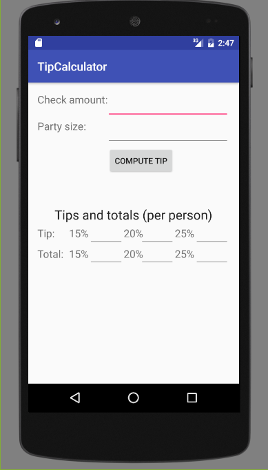
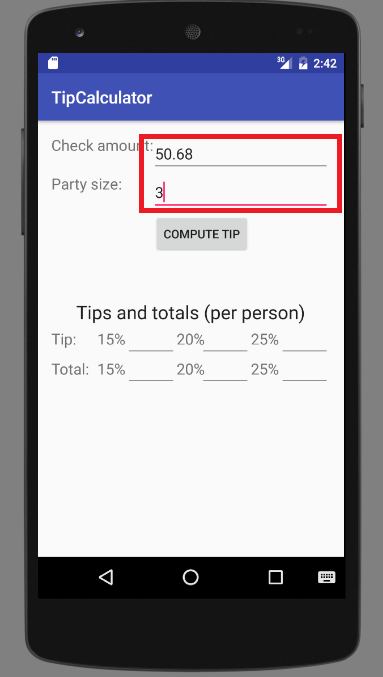
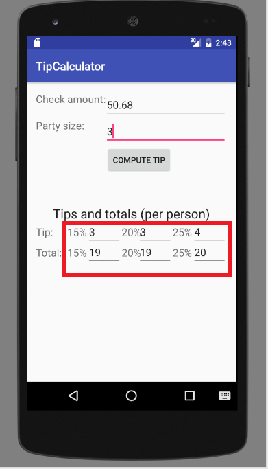
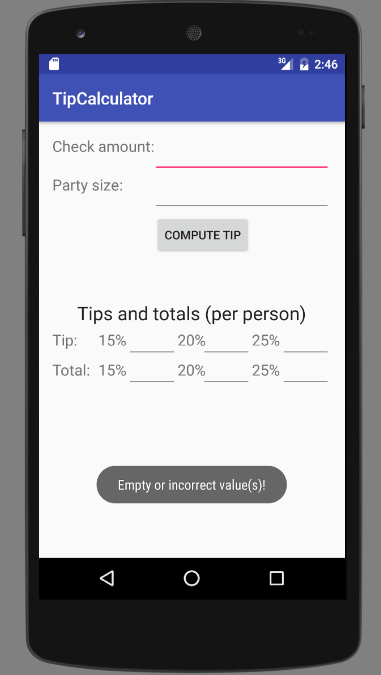

#TipCalculator User Manual

##Introduction

This app is a tip calculator that computes how much tip and total **_each person_** should pay when splitting the check. 

Inputs are the amount of the check and the number of people splitting the check. Outputs are the amount of tip and total per person in case of **_15%, 20% and 25%_** tip amount, assuming people split the check evenly. Outputs are rounded to the closest integer. 

##Audience

This app is used in the envieronment of service industry such as in a restaurant, for the convenience of customers to know how much to pay or for the convenience of seller to know the amount of money to charge. 

##Installation

This app is available on the following platforms:
 - **_Android 4.4_** and above. Downloading website: [play store](http://play.google.com/store)
 - **_IOS 7+_**. Downloading webiste: [Apple Store] (http://www.apple.com/itunes/download/ "Apple store page")
 - minimum API level is **_19_**.
 

##User Interface

Run the app, you will see this page. 

##Instructions

**Step 1:** Input **Check amount** and **Party size** in the text fields highlighted in the red box in the figure below, and click  button `COMPUTE TIP`. The figure below inputs numbers as an example of 3 people sharing a check of $50.68. 

**Step 2:** The app will automatically display the amount of tip and total bill for each person at **Tip** and **Total** next to the corresponding tip percentages **15%**, **20%**, and **25%**. According to the output of the app, the (tip, total) amount of money for each person to pay with 15%, 20%, and 25% tip are (3, 19), (3, 19), and (4, 20), respectively.

**Note:** The input of **Check amount** and **Party size** should be nonnegative values and positive integers, respectively. If the input is empty or invalid, a warning message "Empty or incorrect value(s)!" will pop-up and then disappear.

##Evaluation
The accuracy of this app can be evaluated by checking the reuslts against those at <https://www.google.com/#q=tip+calculator>.

##Release Information

This is v1.0 version. Update coming soon.

##License

This is a free software. No license is needed. Please enjoy! :+1: :yum:
